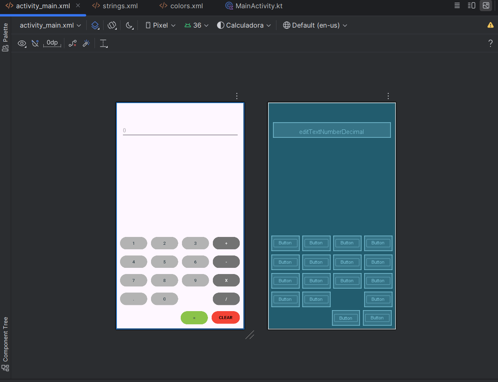
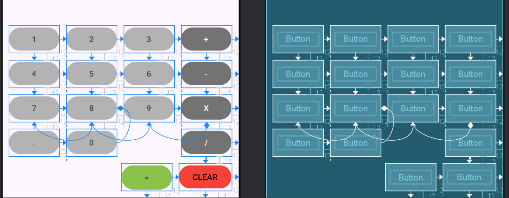
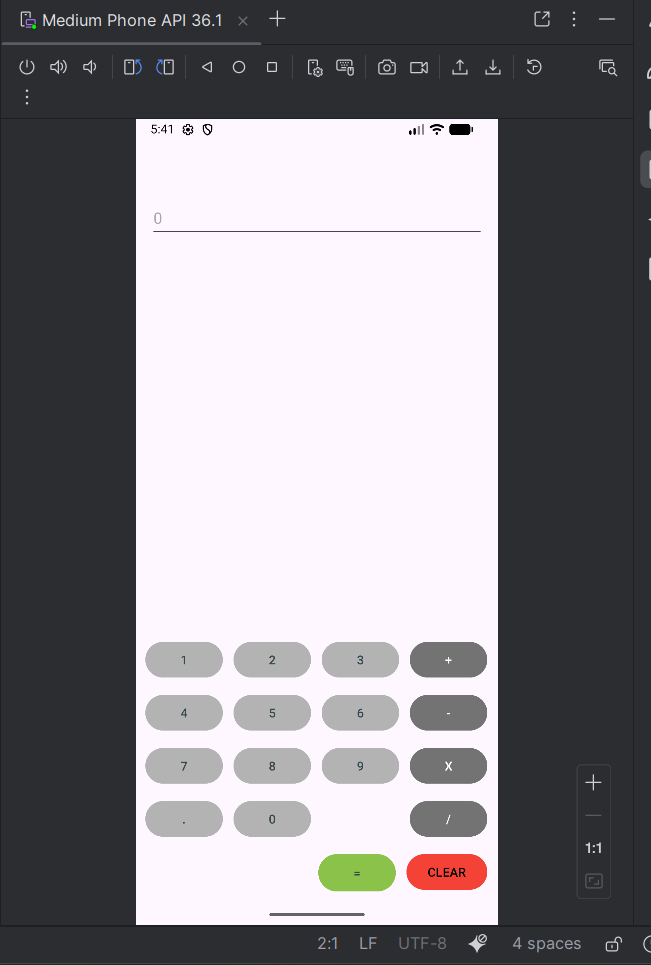

# Calculadora — Diseño XML (entregable)

## Resumen

Repositorio con el entregable del diseño en XML de una calculadora básica para Android Studio. Incluye el layout principal, cadenas de texto y recursos gráficos (capturas de diseño).

## Contenido destacado
- `layout/activity_main.xml` — Diseño de la pantalla principal (`Buttons`, `EditText`, disposición con `ConstraintLayout`).
- `values/strings.xml` — Cadenas de texto usadas por los botones y la interfaz.
- `img/` — Imágenes y capturas del diseño:
	- `Desing.png`
	- `Desing_lines.png`
	- `Running_Android.png`

## Vista previa
Puedes encontrar capturas en la carpeta `img/`. Por ejemplo:

  
*Diseño del layout principal en el editor de Android Studio.*

  
*Modo con guías y líneas de ConstraintLayout para comprobar anclajes y alineaciones.*

  
*Vista de la app ejecutándose en el emulador predeterminado de Android Studio (API 36.1)*

También disponibles en el directorio `img/`:
- `Desing.png` — diseño limpio.
- `Desing_lines.png` — diseño con guías.
- `Running_Android.png` — captura en ejecución.

## Cómo abrir el proyecto en Android Studio
1. Abrir Android Studio.
2. Seleccionar "Open" y elegir la carpeta raíz de este proyecto.
3. En el panel Project, remplazar `layout/activity_main.xml` a `app/src/main/res/layout/activity_main.xml` desde la vista de recursos.
4. Abrir el Editor de Layouts para ver y editar la interfaz.
5. Tambien remplzar/añadir los valor de `values/strings.xml` en `app/src/main/res/values/strings.xml`.

Si quieres ejecutar la app en un emulador o dispositivo necesitarás crear un proyecto mínimo con una `MainActivity` en Kotlin o Java que cargue este layout.

## Notas y recomendaciones
- Los colores de los botones están definidos en XML con `backgroundTint`; se recomienda moverlos a `values/colors.xml` para facilitar el mantenimiento.
- Considera extraer estilos comunes a `values/styles.xml` si planeas ampliar la interfaz.

## Mejoras a realizar
No he añadido colores ni estilos extra, debido a que deberia de crear/modificar archivos adicionales fuera del layout XML.

Tampoco he implementado la `MainActivity` ni la lógica de la calculadora, ya que el entregable se centra en el diseño XML.